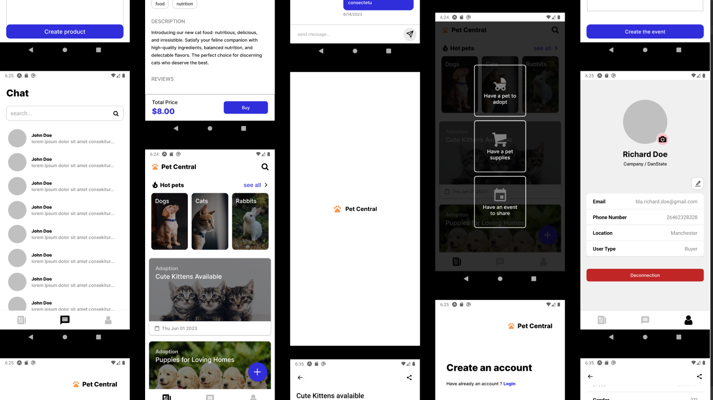

# Pet Central

## About the project

It's a pet marketplace that serves as a convenient and efficient marketplace for pet enthusiasts. Whether you're a provider offering pet services or a customer in search of the perfect pet companion, Pet Central connects you with the right people and resources.



## Features

With Pet Central, you can easily navigate through a variety of pet-related services, including pet adoption, pet sell, and pet supplies sell, all while facilitating seamless communication between providers and customers.

-  **Adopting a Pet:**
   Looking to bring a new furry friend into your family? Pet Central's adoption service connects you with a variety of cute pets looking for loving homes. Simply browse through profiles of cats, dogs, rabbits, and more. You can easily contact adoption providers, ask questions about pets, and submit adoption requests through the app. Find your perfect match and bring happiness to both your life and a deserving pet.

-  **Selling a Pet:**
   If you need to find a new home for your pet or if you're a professional breeder, Pet Central's selling service is perfect for you. You can create profiles for your pets, add descriptions, photos, and other important details. List your pets for sale and receive inquiries from potential buyers. Manage selling requests, negotiate prices, and find the best homes for your beloved pets.

-  **Selling Pet Supplies:**
   At Pet Central, we also have a marketplace for pet supplies. You can find everything your furry friends need, from food and treats to toys and grooming products. Browse through a wide range of high-quality pet supplies. Sellers can create listings, provide descriptions, set prices, and receive orders from eager customers. Whether you're a pet owner or a pet supplies retailer, Pet Central has what you need.

-  **Easy Communication:**
   We understand that communication is essential when it comes to pet services. That's why Pet Central has a built-in messaging system that allows providers and customers to chat directly. You can discuss adoption details, negotiate pet sales, ask about product specifications, and share valuable pet care advice—all within the app's simple and secure interface.

## Getting Started

### Prerequisites

-  Node Js minimum version 16
-  Yarn minimum version 1.22.19

### Setup your environment

To setup your environment, please follow all instructions in this documentation : [Environment setup](https://reactnative.dev/docs/environment-setup)

### Installation

1. Clone the repo

```bash
git clone https://github.com/Online13/pet-marketplace-mobile-challenge.git
```

2. Install dependencies

```bash
yarn
```

### Run application

After installing all dependencies, run the app usign

```bash
yarn start
```

### Todo

-  [x] Add http service
-  [x] Add splash screen
-  [ ] Add Icon for the app
-  [ ] Migrate http service to `zustand` implementation
-  [ ] Handle form validation
-  [ ] Make dynamic data
